# 홀로어르신을 위한 AI 셋톱 박스

<!-- 필수 항목 -->

<!--
## 📑 카테고리

| Application                       | Domain                                | Language                      | Framework                            |
| --------------------------------- | ------------------------------------- | ----------------------------- | ------------------------------------ |
| :black_square_button: Desktop Web | :white_check_mark: AI                 | :white_check_mark: JavaScript | :black_square_button: Vue.js         |
| :white_check_mark: Mobile Web     | :black_square_button: Big Data        | :white_check_mark: TypeScript | :white_check_mark: React             |
| :white_check_mark: Responsive Web | :black_square_button: Blockchain      | :black_square_button: C/C++   | :black_square_button: Angular        |
| :black_square_button: Android App | :white_check_mark: IoT                | :black_square_button: C#      | :white_check_mark: Node.js           |
| :black_square_button: iOS App     | :black_square_button: AR/VR/Metaverse | :white_check_mark: ​Python    | :white_check_mark: Flask/Django      |
| :black_square_button: Desktop App | :black_square_button: Game            | :white_check_mark: Java       | :white_check_mark: Spring/Springboot |
| :white_check_mark: Television App |                                       | :black_square_button: Kotlin  |                                      |

---

-->

<!-- 필수 항목 -->

## 1️⃣ 프로젝트 개요


<br></br>

| 프로젝트명 | 노블리TV |
| --- | --- |
| 팀장 | 김민주 |
| 팀원 | 현상균, 송강산, 오민상, 이지호, 강대수 |
| 기간 | 2023.12.28 ~ 2024.02.16 (6주) |


---

## 2️⃣ 기획 배경

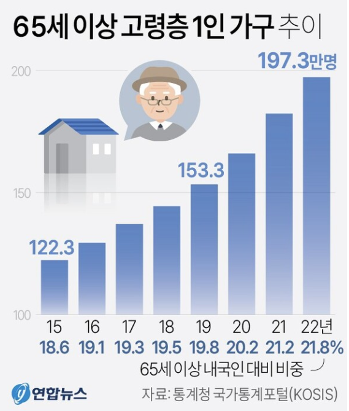
- 홀로 사는 어르신의 비율 증가
- 홀로 어르신의 생활상 어려움 중 심리적 외로움이 13.2% 차지
- 노인 중 96.6%가 TV 시청 또는 라디오 청취

```
💡 Goal

홀로 어르신과 가족의 소통 창구가 되는 AI 셋톱 박스를 개발하여 외로움 문제를 해결

```

---
## 3️⃣ 서비스 특징

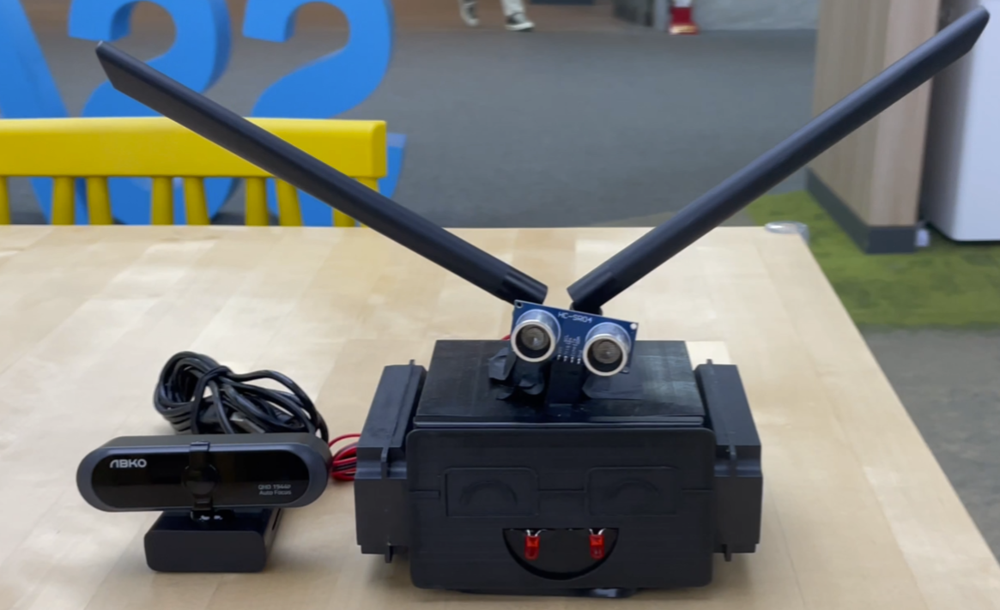

| 기능 | 이유 |
| --- | --- |
| 장기간 TV 시청 시 체조, 퀴즈, 커뮤니티, 일기 등 활동 유도 | 체조 활동, 치매 예방 퀴즈, 가족 커뮤니티를 통한 일상 공유로 외로움 완화
| 음성 일기를 텍스트로 변환해 보호자에 전달 | 노인의 우울증 및 치매 척도 측정 자료로 사용 가능
| 음성 인식 기반 상호작용 | 기계 조작이 불편한 어르신들의 접근성 문제 해결 |
| 일정 등록 및 알림 | 복약, 내원과 같은 중요 일정을 자녀들이 대신 등록하고 어르신에게 알람을 보내 건망증 문제 해결
| 초음파센서와 카메라를 활용한 낙상 알림 | 어르신의 낙상을 감지했을 때 가족에게 알려 사고에 대처

---


## 4️⃣ 서비스 화면

### 체조 활동

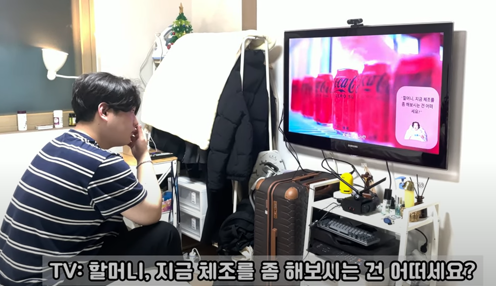
- 장시간 TV 시청 시 체조, 치매 예방 퀴즈, 가족 커뮤니티, 음성 일기 중 한 가지 활동을 추천한 뒤, 긍정 응답 시 진행합니다.

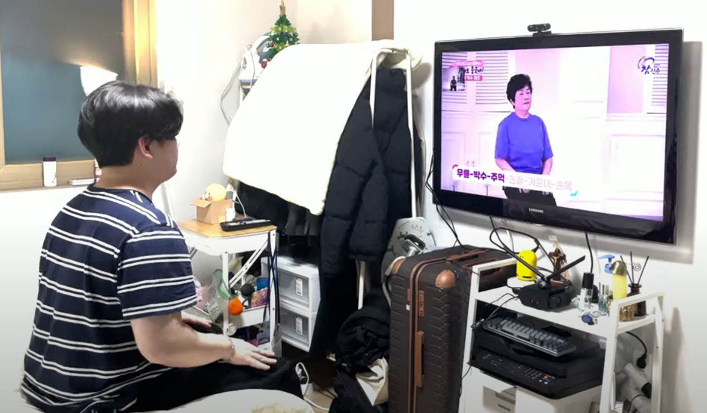
- 가족들이 App에서 등록한 체조 영상을 노블리TV에 받아 송출합니다.
- 카메라를 통해 실시간 촬영되는 체조 동작을 TVA 화면 좌측 상단에 스트리밍합니다.

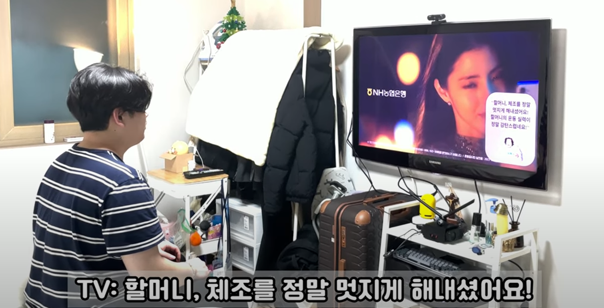
- 체조가 완료되면 하이라이트를 추출하여 App으로 전달합니다.

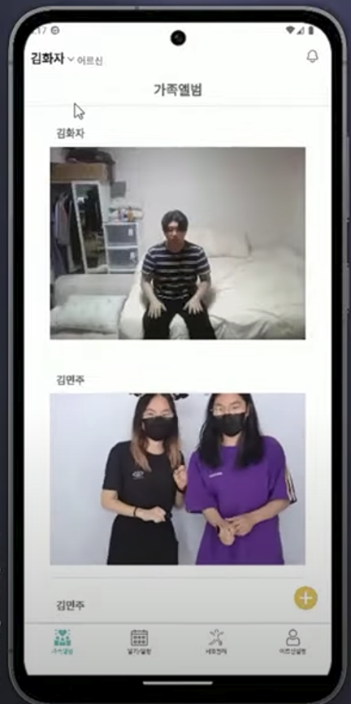
- 가족은 App으로 체조 영상을 확인할 수 있습니다.


### 치매 예방 퀴즈

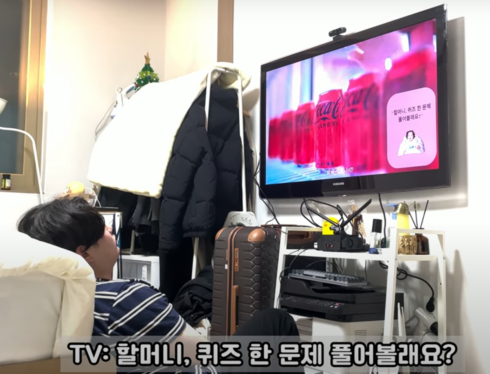
- 장시간 TV 시청 시 체조, 치매 예방 퀴즈, 가족 커뮤니티, 음성 일기 중 한 가지 활동을 추천한 뒤, 긍정 응답 시 진행합니다.

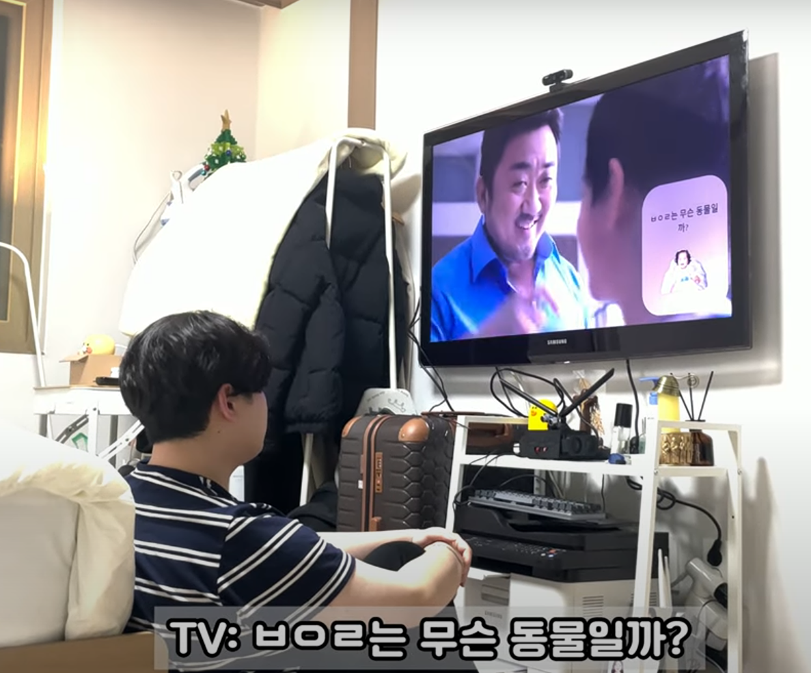
- 초성 퀴즈를 진행합니다.

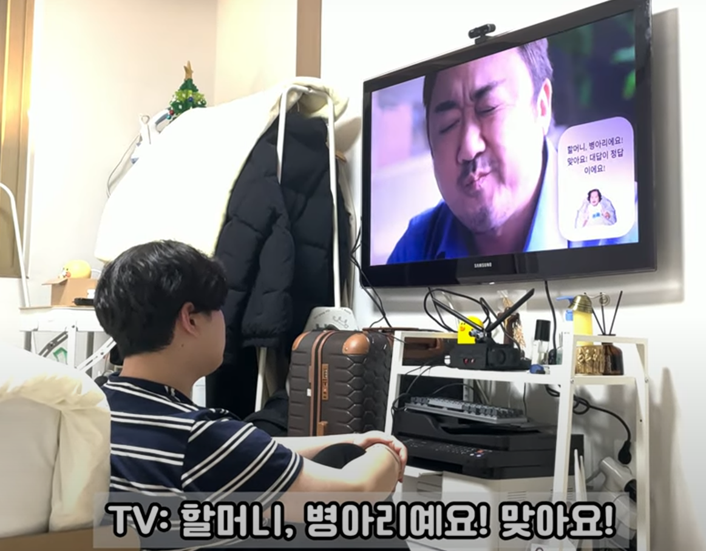
- 정답이 맞는지 음성과 함께 UI로 출력합니다.

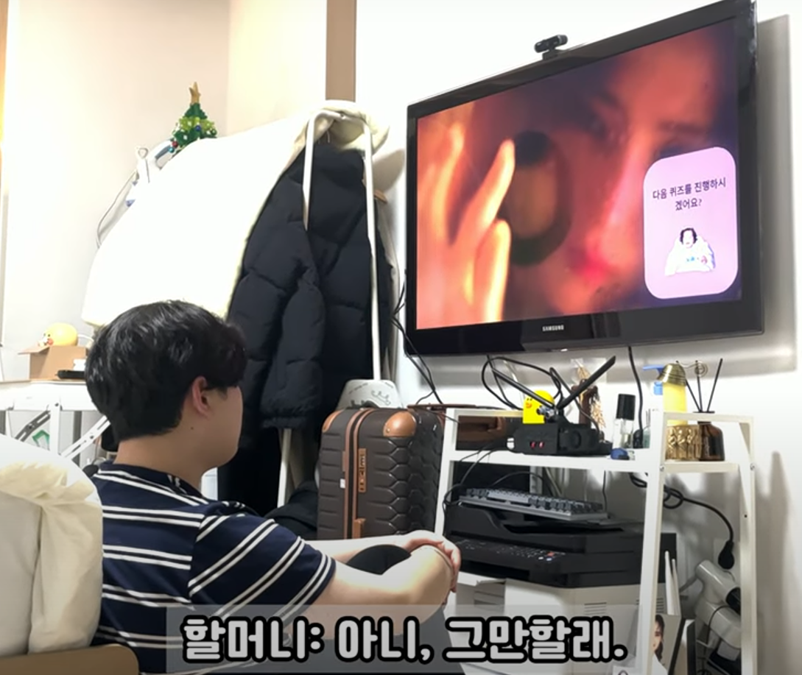
- 퀴즈를 더 진행하고 싶은지 물어본 뒤, 대답에 따라 추가 퀴즈를 내거나 퀴즈를 종료합니다.


### 커뮤니티

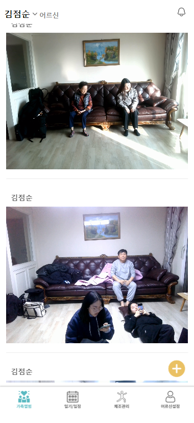

- 메인화면에서 가족 및 어르신이 올린 영상을 확인 할 수 있습니다.

#### 일기 및 일정


- 일기/일정에서 텍스트로 요약정리된 어르신의 음성일기를 확인할 수 있습니다.
- 등록한 일정에 따라 해당 시간에 TV에서 음성과 함께 알림을 띄웁니다.


#### 체조 관리


- 스마트폰 App에서 체조 영상을 등록하면 노블리TV에 전달되어 체조 영상을 띄웁니다.


---

## 5️⃣ 기술 스택

### 1. Frontend
- node.js 20.10.0
- Vite 5.0.11
- React 18.2.0
- Zustand 4.4.7
- Styled-component 6.1.8
- Eslint 8.56.0
- Prettier 3.2.2
- Typescript 5.3.3
- Socket io 4.7.4

### 2. Backend
- OpenJDK 21.0.1
- Spring Boot 3.2.1
  - Project : Gradle - Groovy
- JUnit 5.10.1

### 3. Embedded
- NVIDIA Jetson Nano Developer Kit
  - OS: Ubuntu 20.04.6 LTS
  - Kernal: Linux 4.9.253-tegra
  - Architecture: arm64
  - Jetpack: 4.6
  - L4T: 32.6.1
- Python 3.8.10
- Socket io 4.7.4
- node.js 20.10.0
- Flask 3.0.2

### 4. DB
- Docker 25.0.1
- Docker-Compose 1.29.2
- Jenkins 2.443
- nginx

### 5. Infra
- Docker 25.0.1
- Docker-Compose 1.29.2

### 6. AI
- PoseNet
- Visual Transformer (ViT)
- Chat GPT 3.5 terbo
- Chat GPT 4
- NAVER Clova

---

## 6️⃣ 문서

### [기능 명세서](https://www.notion.so/minju98/8e23409ab41f460da94377b842fe4316?v=bf049a1dff9b4514b016a50d506d2f5a)

### [요구 사항 명세서](https://www.notion.so/minju98/1598af230a404e8c8f51531f8d981cdb)

### [REST API 연동 규격서](https://www.notion.so/minju98/Rest-API-590a12f831eb43c8882928b6f9f6b144)

### [빌드 및 배포 관련 문서](https://www.notion.so/minju98/2e467d7e0c1a4ef382c09f934c436b20)

### Swagger를 통해서도 API 명세서 정리

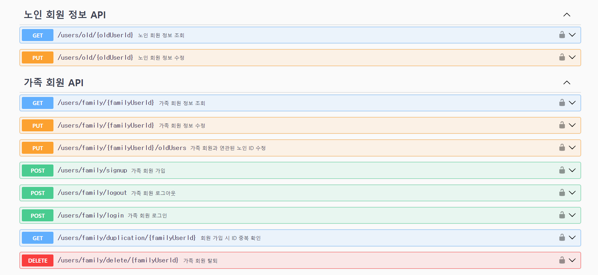

### ERD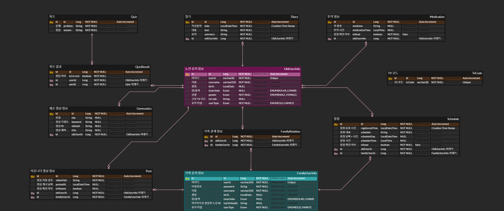

### 시스템 아키텍처

